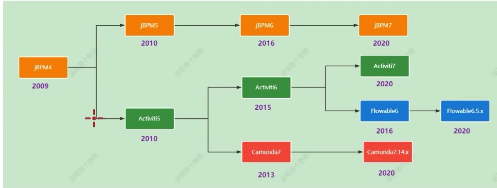
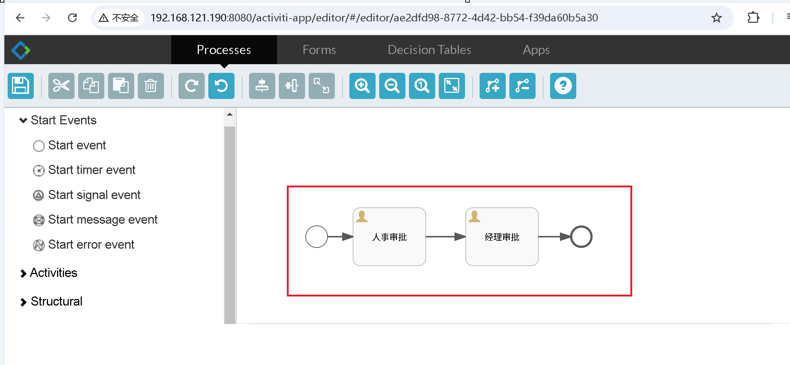
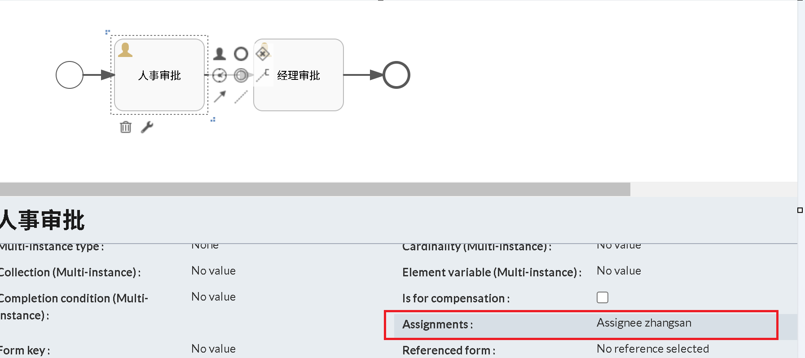
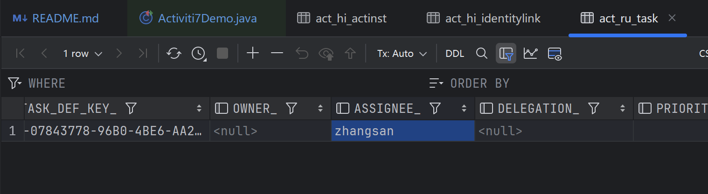
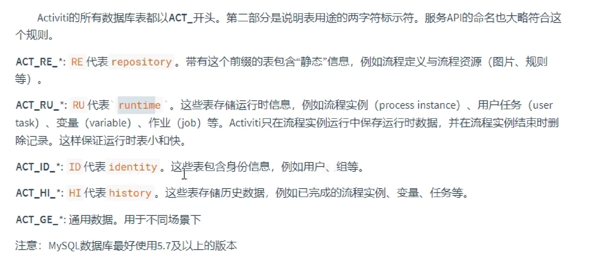
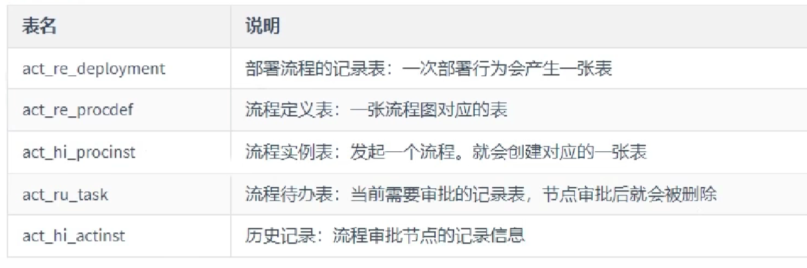
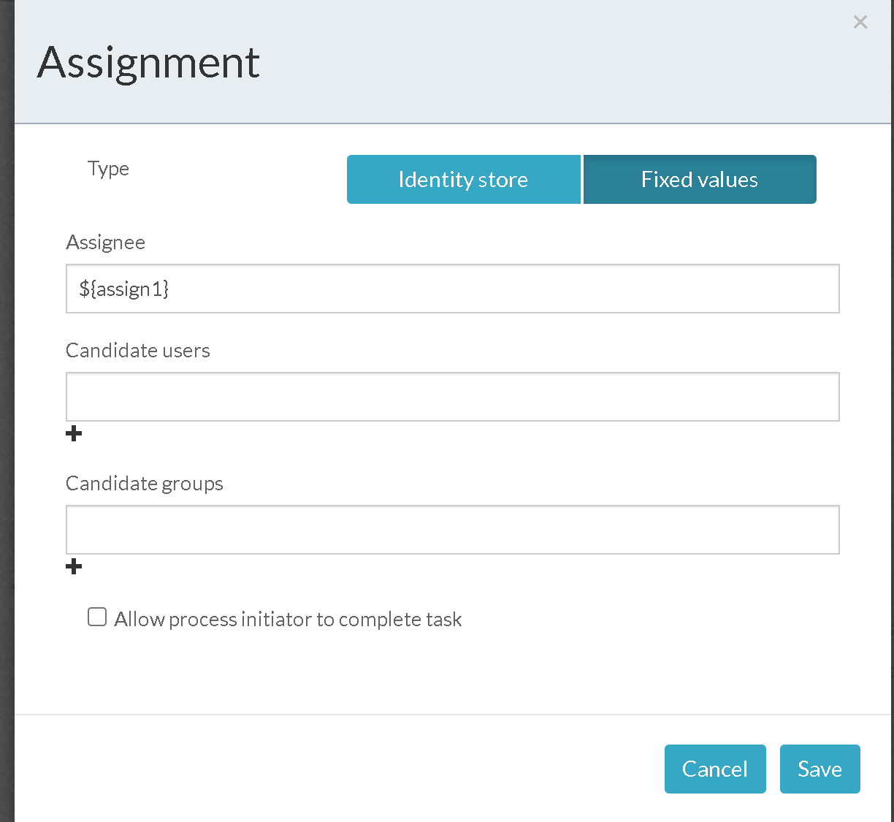
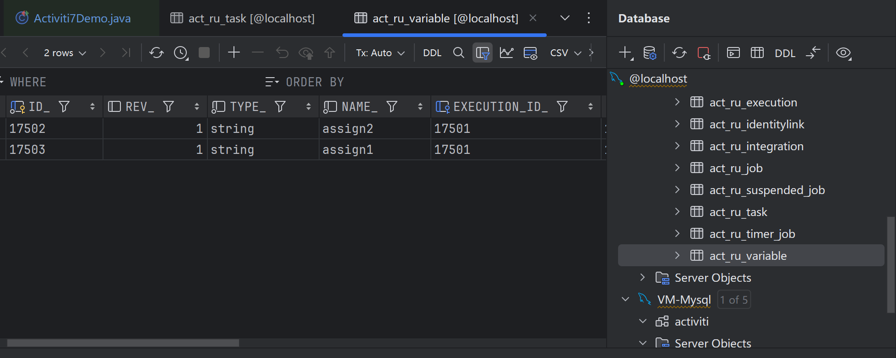

# study-workflow
三大工作流引擎技术Activiti、Flowable、Camunda

视频地址：https://www.bilibili.com/video/BV1EmRpYrExm

# 目录
- [Activiti7](#Activiti7)

# Activiti7
- activiti-app.war 地址：src/main/resources/static


## 1.1 工作流框架版本
- 主流工作流版本：
- 都由jbmp4/activiti5发展而来，不断演变出Activiti、Flowable、Camunda。  
- 所以表结构，框架上有相似之处


## 1.2、1.3获取ProcessEngine
可以通过xml配置文件的，或者代码的方式获取ProcessEngine对象
```java
        // 获取默认的ProcessEngine对象，会加载resource目录下的activiti.cfg.xml文件
        ProcessEngine processEngine = ProcessEngines.getDefaultProcessEngine();
        System.out.println(processEngine);

        // 通过ProcessEngineConfiguration获取ProcessEngine对象
        ProcessEngine processEngine = ProcessEngineConfiguration.createStandaloneProcessEngineConfiguration()
                .setJdbcUrl("jdbc:mysql://localhost:3306/activiti7")
                .setJdbcDriver("com.mysql.cj.jdbc.Driver")
                .setJdbcUsername("root")
                .setJdbcPassword("root")
                .setDatabaseSchemaUpdate("true")// 设置自动维护表结构
                .buildProcessEngine();

```

## 1.4 在线流程设计器
绘制流程图，在官网下载activiti-app.war包，并在tomcat7中部署运行  
```shell
docker run -d -p 8080:8080 --name tomcat \
-v /root/activiti-app.war:/usr/local/tomcat/webapps/activiti-app.war \
tomcat:8.0
```
- 登录： admin test  
- 登录后进入，创建流程，进入流程绘制页面，绘制一个简单的流程。


- 下载后得到一个xml，将xml部署到数据库中，即可使用。

## 1.5 第一个流程的部署
```java
        // 1.获取ProcessEngine对象
        ProcessEngine processEngine = ProcessEngines.getDefaultProcessEngine();
        // 2.获取RepositoryService对象
        RepositoryService service = processEngine.getRepositoryService();
        // 3.完成部署操作
        Deployment deploy = service
                .createDeployment()
                .addClasspathResource("flow/test1.bpmn20.xml")
                .name("第一个流程")// 是一个流程部署的行为，可以部署多个流程定义
                .deploy();
```
- act_re_deployment表：部署信息表
- act_re_procdef表：流程定义表

## 1.6 查询流程定义
```java
        // 1.获取ProcessEngine对象
        ProcessEngine processEngine = ProcessEngines.getDefaultProcessEngine();
        // 2.获取RepositoryService对象
        RepositoryService service = processEngine.getRepositoryService();
        // 3.完成部署信息
        service.createDeploymentQuery()
               .list()
               .forEach(deployment -> {
                   System.out.println(deployment.getId());
                   System.out.println(deployment.getName());
               });
```

## 1.7 发起一个流程
```java
        // 1.获取ProcessEngine对象
        ProcessEngine processEngine = ProcessEngines.getDefaultProcessEngine();
        // 2.获取RuntimeService对象
        RuntimeService service = processEngine.getRuntimeService();
        // 3.发起流程,返回的是流程实例对象
        ProcessInstance processInstance = service.startProcessInstanceById("test1:1:3");
```
部署流程成功后，就可以发起流程。  
在发起后，会在act_ru_task表中生成当前流程对应的步骤，等待zhangsan审批。


## 1.8 代办任务查询
```java
        // 1.获取ProcessEngine对象
        ProcessEngine processEngine = ProcessEngines.getDefaultProcessEngine();
        // 2.获取TaskService对象
        TaskService service = processEngine.getTaskService();
        // 3.查询任务,Task对象对应的是表act_ru_task
        service.createTaskQuery().taskAssignee("zhangsan").list().forEach(task -> {
            System.out.println(task.getId());
            System.out.println(task.getName());
            System.out.println(task.getAssignee());
        });
```

## 1.9 任务审批
```java
        // 1.获取ProcessEngine对象
        ProcessEngine processEngine = ProcessEngines.getDefaultProcessEngine();
        // 2.获取TaskService对象
        // TOOD 这里可以先查出当前用的待审批任务，然后再进行审批
        TaskService service = processEngine.getTaskService();
        // 3.完成任务
        service.complete("2505");
```

## 1.1.0 Activiti7相关表介绍



## 1.1.1 流程设计器持久化
流程设计器将数据持久化到数据库中，需要在流程设计器中设置数据库连接信息。
```shell
docker network create activiti-net && \
docker run -d --name mysql-activiti --network activiti-net \
-e MYSQL_ROOT_PASSWORD=root \
-e MYSQL_DATABASE=activiti \
-e MYSQL_USER=activiti_user \
-e MYSQL_PASSWORD=root \
-p 3306:3306 \
mysql:8.0.37-debian && \
docker run -d --name activiti-app --network activiti-net \
-v /root/activiti-app.war:/usr/local/tomcat/webapps/activiti-app.war \
-v /root/config/activiti-app.properties:/usr/local/tomcat/webapps/activiti-app/WEB-INF/classes/META-INF/activiti-app/activiti-app.properties \
-p 8080:8080 \
tomcat:8.0
```
## 1.1.2 activiti-app汉化

## 1.1.3 任务分配
通过表达式，动态替换审批人，来实现任务的分配。
- ${myVar}
- ${myBean.myProperty}


- 完成流程部署
- 为${myVar}赋值,后启动对应的流程
- 查询act_ru_task表，assignee已经赋值  
act_ru_variable表：流程变量表
